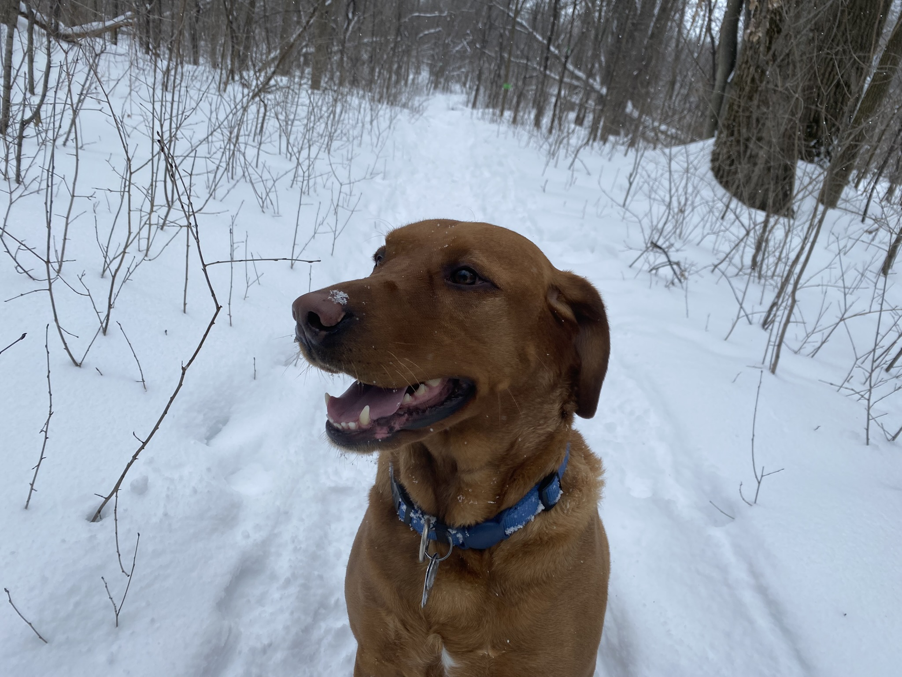

  <h1>Hello there, I'm Alix!</h1>
  <h3>(and this is my dog)</h3>
  <h5>(he says hi <3)</h5>
  

  <h2>About Me</h2>
  <ul>
    <li>I'm a full-stack developer, but I love to be a jack-of-all-trades in general!</li>
    <li>I'm passionate about any project I can get my hands on.</li>
    <li>Focusing on learning golang right now.</li>
    <li>I have my own self-hosted Jenkins server for my open-source projecs :)</li>
  </ul>
  <h3>Here are my open-source libraries:</h3>
  <ul>
    <li><a href="https://github.com/SgtMilk/pdfparser">A more human pdf parser</a></li>
    <li><a href="https://github.com/SgtMilk/global-components">Global components for my TypeScript React projects</a></li>
  </ul>

  &nbsp;
  &nbsp;
  &nbsp;
  &nbsp;
  &nbsp;
  &nbsp;
  &nbsp;
  &nbsp;
  &nbsp;
  &nbsp;
  &nbsp;

<!--

Here are some ideas to get you started:

- 🔭 I’m currently working on ...
- 🌱 I’m currently learning ...
- 👯 I’m looking to collaborate on ...
- 🤔 I’m looking for help with ...
- 💬 Ask me about ...
- 📫 How to reach me: ...
- 😄 Pronouns: ...
- ⚡ Fun fact: ...
-->
